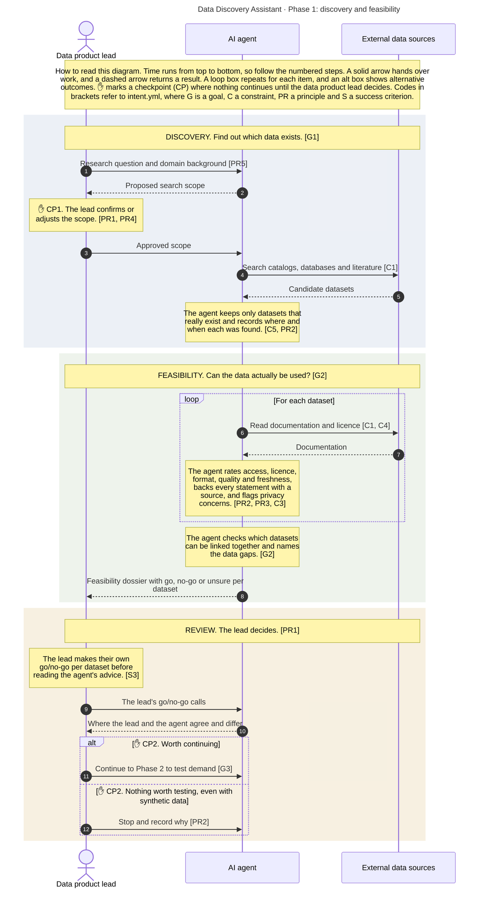
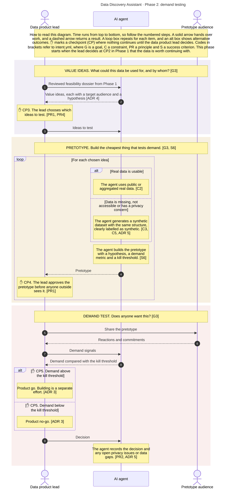

# Flow view

How work moves from research question to product decision, and who does what. Conventions: [README.md](README.md).

**Actors:** the **data product lead** decides and reviews · the **AI agent** does the work: searches, reads, assesses, drafts, builds · the **pretotype audience** reacts to pretotypes.

## Phase 1 · Discovery and feasibility

From research question to a reviewed feasibility dossier.

### Responsibility matrix

| # | Stage | Data product lead | AI agent | Produces | Intent | Open |
|---|---|---|---|---|---|---|
| 1 | Scope the question | Write question and domain background; **CP1: confirm scope** | Turn the question into search terms, entities and ontologies | Scope | PR5, PR4 | H1 |
| 2 | Discover sources | – | Search for candidate datasets | Candidate list | G1, C1 | H2 |
| 3 | Verify sources | – | Check each dataset exists; drop what does not; record provenance and check date | Dataset inventory | C5, PR2 | |
| 4 | Assess feasibility | – | Read documentation and licence; rate each dataset with a source per claim; flag privacy concerns; never access restricted data | Dossier entry per dataset | G2, C1, C3, C4, PR2, PR3 | H3 |
| 5 | Assess combinability | – | Map shared identifiers and ontologies; name data gaps | Combination assessment | G2 | H5 |
| 6 | Review | Record own go/no-go per dataset *before* seeing the agent's; **CP2: worth continuing?** | Compare the lead's calls with its own; write the decision log | Reviewed dossier, decision log | PR1, S3, ADR 3 | H4, H8, H9 |

### Sequence

## Phase 2 · Demand testing

From a reviewed feasibility dossier to a product go/no-go. Starts only when CP2 in Phase 1 says "worth continuing".

### Responsibility matrix

| # | Stage | Data product lead | AI agent | Produces | Intent | Open |
|---|---|---|---|---|---|---|
| 7 | Derive value ideas | **CP3: choose which ideas to test** | Derive value ideas the feasibility findings still allow, each with a target audience and a falsifiable hypothesis | Value hypotheses | G3, ADR 4, PR4 | |
| 8 | Prepare data | – | Per idea: use real data where usable; generate a labelled synthetic dataset where data is missing, inaccessible or privacy-flagged | Pretotype dataset | C2, C3, C5, ADR 5 | H11 |
| 9 | Build pretotype | **CP4: approve before it goes out** | Build the pretotype with demand metric and kill threshold | Pretotype | G3, S6, PR1 | |
| 10 | Test demand | Share the pretotype with the audience; collect reactions | Compare demand signals with the kill threshold | Demand report | G3, S6 | H7 |
| 11 | Decide | **CP5: product go/no-go** | Record the decision and open issues (privacy, data gaps) | Decision log entry | ADR 3, PR2 | |

### Sequence

## Hotspots

| ID | Stage | Open question | Intent |
|---|---|---|---|
| H1 | 1 | In what form is domain background supplied (free text, ontology list, known sources)? | PR5 |
| H2 | 2 | Which discovery channels: data catalogs (e.g. re3data, Google Dataset Search), web search, literature, model knowledge? | G1, S1 |
| H3 | 4 | Documentation only, or also sample the data? | PR4 |
| H4 | 6 | What happens to datasets the agent is unsure about? | PR3 |
| H5 | 5 | Does the flow loop back to discovery when data gaps are found, or go straight to synthetic data? | G1, G2, ADR 5 |
| H7 | 10 | Is sharing with the audience and collecting reactions done by the lead outside the system (as drawn), or by the agent? | G3, S6 |
| H8 | 6, 11 | Format and storage of the decision log | PR2, S5 |
| H9 | 6 | What makes Phase 1 "worth continuing" now that synthetic data can fill gaps? | ADR 3, ADR 5 |
| H10 | all | Which language model and tools does the agent use? | PR6 |
| H11 | 8 | How realistic must synthetic data be for a pretotype to be credible? | C3, S6 |

H6 (checkpoint to choose which ideas get a pretotype) is resolved as CP3.

## Changelog

- v7 (2026-10-03): split into two self-contained diagrams, one per phase, each with its own title, reading key and responsibility matrix.
- v6 (2026-10-03): Phase 2 added to the same diagram. Synthetic data step added for data that is missing, inaccessible or privacy-flagged (intent C3 and ADR 5 extended). New checkpoints CP3 (choose ideas), CP4 (approve pretotype), CP5 (product go/no-go). CP2 reworded to "worth continuing". H6 resolved; H11 added. Pretotype audience added as an actor.
- v5 (2026-10-03): explicit font and spacing so notes render inside their boxes; matrix column renamed to data product lead; context view removed and H10 moved here.
- v4 (2026-10-03): reading key in full sentences at the top; intent codes back in the diagram; automatic text wrapping so notes render inside their boxes.
- v3 (2026-10-03): diagram made self-explanatory for sharing: title, built-in reading key, plain language, no intent IDs (those stay in the matrix); human lane renamed "Data product lead".
- v2 (2026-10-03): two actors (You, AI agent) for the prototype; checks previously assigned to code are done by the agent.
- v1 (2026-10-03): replaced the single flowchart with a responsibility matrix and a sequence diagram per phase; human checkpoints renamed CP1, CP2 to avoid clashing with goal IDs. Phase 1 redrawn; phase 2 pending.
- v0 (2026-10-03): first draft from intent.yml v0.6.
